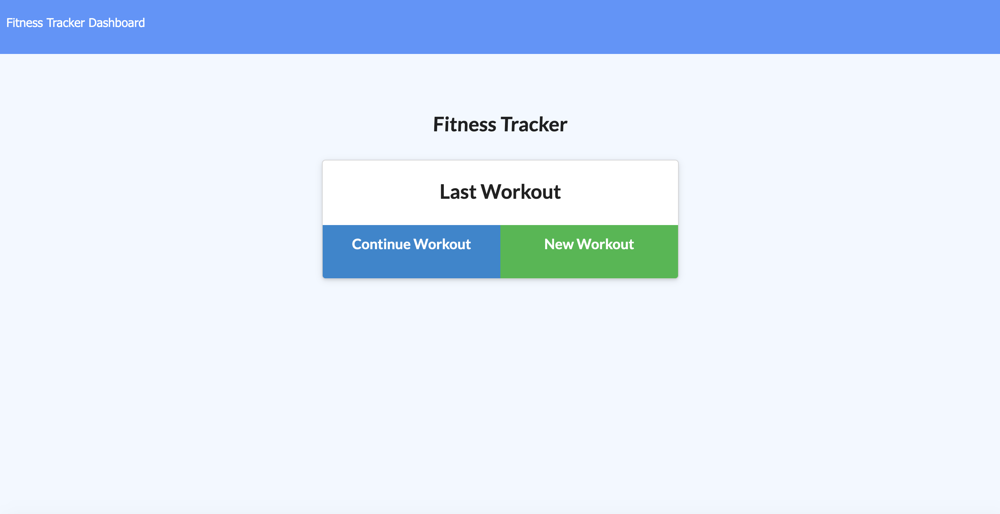
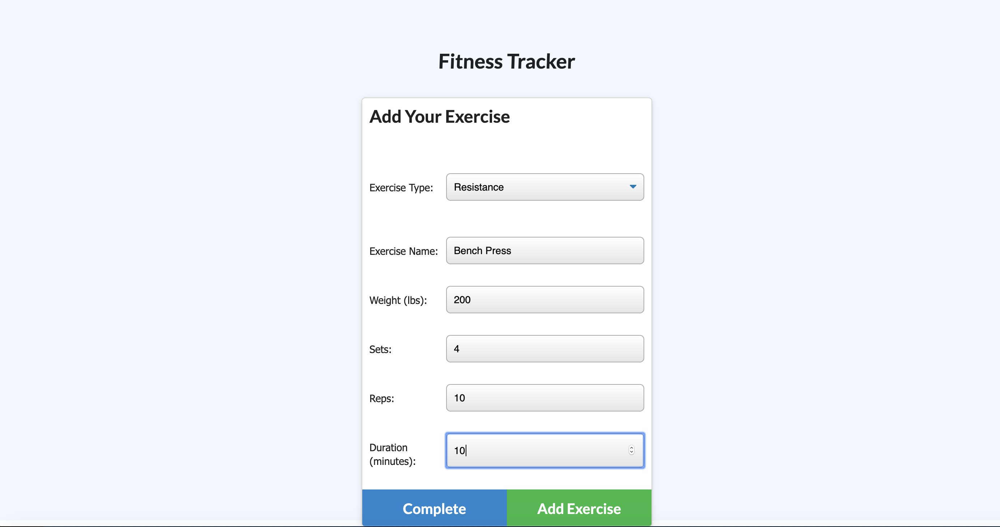
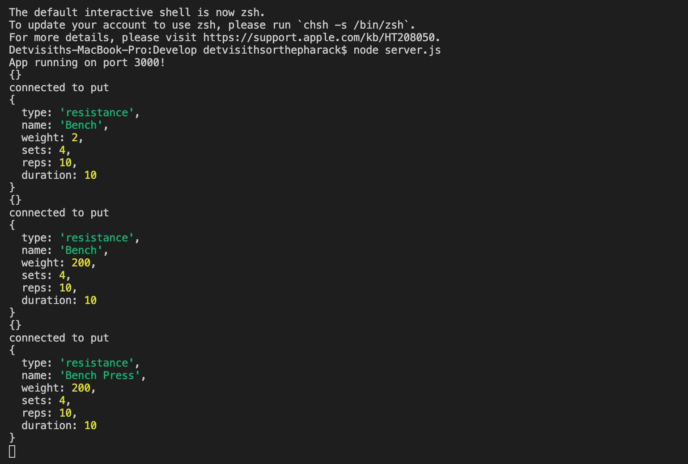

# workout-tracker

Welcome to the Workout Tracker, an app that lets you track your daily workout routine. 

As a fitness geek, you want to be able to view, create, and track your daily workouts. With this app you are able to log multiple exercises in a workout on a given day. You should also be able to track the name, type, weight, sets, reps, and duration of exercise.

Technologies:
Mongo / Mongoose / ExpressJS / NodeJS 

Check out the app here: https://det-workout-tracker.herokuapp.com/

